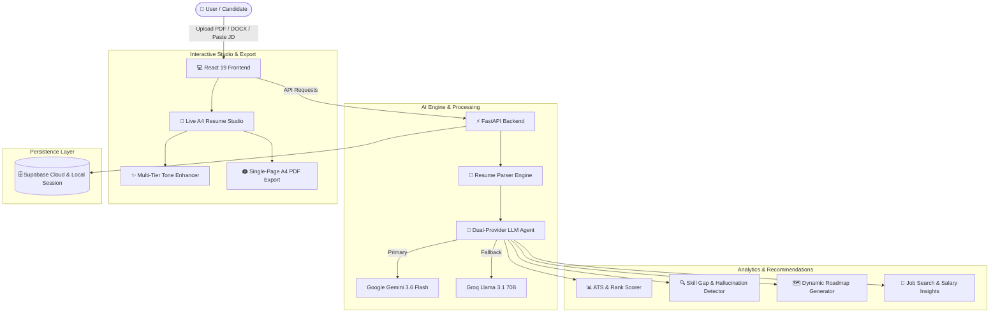

<div align="center">

# ⚡ Resume-Agent
### *Next-Gen Agentic AI Resume Analyzer, ATS Ranker & Live A4 Resume Studio*

[](https://fastapi.tiangolo.com)
[](https://react.dev)
[](https://vitejs.dev)
[](https://tailwindcss.com)
[](https://ai.google.dev)
[](https://groq.com)
[](https://www.docker.com)
[](https://render.com)

<p align="center">
  <b>Transforming how engineers and professionals benchmark, optimize, and build ATS-tailored resumes using autonomous LLM agents, multi-dimensional scorecards, and interactive single-page A4 live rendering.</b>
</p>

---

[Key Features](#-key-features) • [System Architecture](#-system-architecture) • [Tech Stack](#-tech-stack) • [Quick Start](#-quick-start) • [Docker & Deployment](#-docker--render-deployment) • [API Reference](#-api-endpoints)

---

</div>

<br />

## 🌟 Key Features

### 1. 🎯 Multi-Dimensional ATS Compatibility & Rank Scoring
- **Holistic Candidate Benchmarking**: Calculates an overall **Rank Score (0-100)** broken down across **Skills Match**, **Experience Relevance**, **Education Fit**, and **Project Alignment**.
- **ATS Parsing & Match Engine**: Computes exact percentage alignments against target Job Descriptions (JD) to eliminate automated filtering rejections.
- **Visual Gap Matrix**: Pinpoints matching competencies vs. missing requirements with interactive learning links.

### 2. 🛡️ Skill Discrepancy & Hallucination Detector
- Scans candidate resumes to detect claimed skills that lack verifiable project proof or contextual experience.
- Provides actionable diagnostic reasons to help candidates legitimately substantiate competencies.

### 3. 🗺️ Personalized Career Roadmaps & Learning Hub
- Generates dynamic, multi-week upskilling roadmaps tailored to specific skill gaps.
- Curates real-time, vetted learning resources:
  - 🎥 **YouTube Deep Dives** (freeCodeCamp, Fireship, Traversy Media, 3Blue1Brown)
  - 📑 **Comprehensive Technical Articles & Documentation** (MDN, Real Python, Dev.to)
  - 🔬 **Research Papers & Whitepapers** (arXiv, official engineering specs)

### 4. 📄 Interactive Live A4 Resume Studio
- **True A4 Single-Page Preview**: Side-by-side split editor with real-time typography scaling, page cutoff boundary guides, and zoom controls.
- **Multi-Tone AI Enhancer**:
  - **✨ Essential**: Tight, action-oriented ATS phrasing.
  - **✨ Refined**: Industry-standard terminology with quantified impact.
  - **✨ Elevated**: Executive-level architectural and leadership framing.
  - **Dual Insights**: Real-time **| IMPROVEMENTS** checkmarks and **| PRO TIPS** recommendations.
- **1-Click JD Tailoring**: Apply suggested resume improvements directly into your live draft with a single click.
- **Draft Persistence & History Drawer**: Rename, save mid-edit, manage versions, and load any past draft anytime.
- **Pixel-Perfect PDF Export**: Clean, single-page A4 print stylesheet formatting.

### 5. 💼 Real-Time Job Finder & Salary Intelligence
- Integrates with remote job APIs (with intelligent LLM fallback) to discover high-match opportunities tailored to candidate profiles.
- Provides competitive market salary bands and compensation insights.

### 6. 🔐 Cloud History & Self-Healing Authentication
- Powered by Supabase database storage with automatic, self-healing local session fallback.

---

## 🏗️ System Architecture



---

## 💻 Tech Stack

### Frontend
| Technology | Description |
| :--- | :--- |
| **React 19** | Modern reactive UI framework |
| **Vite 8** | High-speed build tool and development server |
| **Tailwind CSS v4** | Utility-first responsive styling engine |
| **Zustand** | Lightweight, persistent state management |
| **Lucide React** | Consistent, crisp icon set |
| **Recharts** | Interactive charting for score rings and analytics |
| **Axios** | Robust HTTP client with interceptors |

### Backend
| Technology | Description |
| :--- | :--- |
| **FastAPI** | High-performance asynchronous Python web framework |
| **Uvicorn** | Lightning-fast ASGI production server |
| **Pydantic v2** | Strict data validation and schema definitions |
| **PyPDF2 & python-docx** | Document extraction and text normalization |
| **HTTPX** | Async HTTP client for live job search APIs |
| **Supabase** | Cloud Postgres database and authentication |

### AI & LLM Infrastructure
| Model | Role |
| :--- | :--- |
| **Google Gemini 3.6 Flash** | Primary multi-modal intelligence for deep resume parsing & roadmap generation |
| **Groq Llama 3.1 70B Versatile** | Ultra-low latency fallback reasoning engine |

---

## 🚀 Quick Start

### Prerequisites
- **Node.js**: v18 or higher (`node -v`)
- **Python**: v3.10 or higher (`python --version`)
- **API Keys**: Google Gemini API Key and/or Groq API Key

---

### 1. Clone the Repository
```bash
git clone https://github.com/kulkarniparth30/Resume-Agent-.git
cd Resume-Agent-
```

### 2. Backend Setup
```bash
cd backend

# Create virtual environment
python -m venv venv

# Activate virtual environment
# Windows:
venv\Scripts\activate
# macOS/Linux:
source venv/bin/activate

# Install dependencies
pip install -r requirements.txt

# Create .env file
cp .env.example .env  # or create .env directly
```

Configure your `backend/.env`:
```env
GEMINI_API_KEY=your_gemini_api_key_here
GROQ_API_KEY=your_groq_api_key_here
SUPABASE_URL=https://your-project.supabase.co
SUPABASE_KEY=your_supabase_key_here
```

Start the backend server:
```bash
uvicorn main:app --host 0.0.0.0 --port 8000 --reload
```
The backend will be live at `http://localhost:8000`.

---

### 3. Frontend Setup
```bash
cd ../frontend

# Install dependencies
npm install

# Start Vite dev server
npm run dev
```
The frontend will be live at `http://localhost:5173`.

---

## 🐳 Docker & Render Deployment

This project includes a **production-ready multi-stage Dockerfile** that builds the React frontend into static assets and serves both frontend and API through a single high-performance FastAPI instance.

### Run with Docker Locally
```bash
# Build and run container
docker build -t resume-agent .
docker run -p 8000:8000 \
  -e GEMINI_API_KEY="your_key" \
  -e GROQ_API_KEY="your_key" \
  resume-agent
```
Visit `http://localhost:8000`.

---

### 1-Click Deployment on Render

1. Go to [dashboard.render.com](https://dashboard.render.com/) and click **New +** → **Blueprint**.
2. Connect your repository: `kulkarniparth30/Resume-Agent-`.
3. Render automatically detects [`render.yaml`](./render.yaml).
4. Supply your environment variables:
   - `GEMINI_API_KEY`
   - `GROQ_API_KEY`
   - `SUPABASE_URL`
   - `SUPABASE_KEY`
5. Click **Apply** — Render builds and hosts your full-stack application on a live HTTPS URL.

---

## 🔌 API Endpoints

| Method | Endpoint | Description |
| :--- | :--- | :--- |
| `POST` | `/api/analyse` | Run deep ATS compatibility & rank analysis on resume vs JD |
| `POST` | `/api/analyse/rank-multiple` | Benchmarks and ranks a batch of resumes against a job description |
| `POST` | `/api/resume/upload` | Upload PDF/DOCX file and extract sanitized text content |
| `POST` | `/api/ai/enhance-section` | AI tone enhancement (*Essential*, *Refined*, *Elevated*) |
| `POST` | `/api/ai/enhance-bullet` | Action-verb optimization for individual resume bullet points |
| `POST` | `/api/roadmap/generate` | Generate personalized multi-week career roadmap |
| `POST` | `/api/learn/resources` | Curate YouTube, article, and research paper learning resources |
| `GET` | `/api/jobs` | Real-time matching jobs from Remotive API / AI fallback |
| `POST` | `/api/projects/guide` | Step-by-step architecture & implementation guide for recommended projects |
| `POST` | `/api/auth/signup` | Register a new user account |
| `POST` | `/api/auth/login` | Authenticate existing user credentials |
| `GET` | `/api/history` | Retrieve saved analysis history |
| `GET` | `/health` | Uptime and health check endpoint |

---

## 📁 Project Structure

```text
Resume-Agent-/
├── Dockerfile                  # Production multi-stage Docker build
├── docker-compose.yml          # Local container orchestration
├── render.yaml                 # 1-Click Render Blueprint configuration
├── .dockerignore               # Optimized Docker build exclusions
├── .gitignore                  # Git ignore rules
├── README.md                   # Project documentation
│
├── backend/                    # FastAPI Backend Application
│   ├── main.py                 # Application entry point & SPA static routing
│   ├── config.py               # Environment configuration & fallbacks
│   ├── requirements.txt        # Python dependency manifest
│   ├── routes/                 # Modular API Route Controllers
│   │   ├── analyse.py          # Resume analysis & multi-resume ranking
│   │   ├── resume.py           # File upload & text extraction
│   │   ├── ai.py               # Section & bullet point AI enhancers
│   │   ├── roadmap.py          # Career roadmap generation
│   │   ├── learn_resources.py  # Educational resource aggregator
│   │   ├── jobs.py             # Job listing search & recommendations
│   │   ├── projects.py         # Portfolio project building guides
│   │   ├── auth.py             # User authentication routes
│   │   └── history.py          # Analysis history management
│   └── services/               # Core Business Logic & AI Services
│       ├── analyser.py         # ATS scoring & skill gap algorithms
│       ├── llm_service.py      # Dual-provider LLM caller (Gemini + Groq)
│       ├── resume_parser.py    # PDF/DOCX file extractors
│       ├── roadmap_generator.py# Up-skilling timeline synthesizer
│       ├── learn_service.py    # Vetted learning resources curator
│       ├── job_search_service.py# Remotive API + AI fallback scraper
│       ├── project_service.py  # Step-by-step project blueprint builder
│       └── supabase_service.py # Cloud database & self-healing session auth
│
└── frontend/                   # React 19 + Vite Web Application
    ├── package.json            # Frontend dependency manifest
    ├── vite.config.js          # Vite build & plugin configuration
    ├── index.html              # HTML shell
    └── src/
        ├── App.jsx             # Route definitions & protected route wrapper
        ├── index.css           # Tailwind CSS v4 styling & color tokens
        ├── api/                # API client adapters (Axios)
        │   ├── client.js       # Base Axios instance & auth interceptors
        │   ├── analyse.js      # Analysis & upload endpoints
        │   ├── ai.js           # AI tone enhancer endpoints
        │   ├── auth.js         # User login & signup endpoints
        │   ├── jobs.js         # Job fetching endpoints
        │   ├── learn.js        # Educational resources endpoints
        │   └── projects.js     # Project guide endpoints
        ├── components/         # Reusable UI Components
        │   ├── Navbar.jsx      # Navigation header with auth controls
        │   ├── ATSScoreRing.jsx# Circular animated score rings
        │   ├── SkillCard.jsx   # Interactive skill badge pills
        │   ├── SkillGapChart.jsx# Visual gap analysis matrix
        │   ├── FakeSkillAlert.jsx# Discrepancy warning cards
        │   ├── JobCard.jsx     # Recommended job opportunity cards
        │   ├── CourseCard.jsx  # Course recommendation cards
        │   ├── ProjectCard.jsx # Portfolio project cards
        │   ├── SalaryChart.jsx # Compensation band insights
        │   ├── LearnModal.jsx  # Vetted learning resources modal
        │   ├── ProjectGuideModal.jsx # Step-by-step project blueprints
        │   └── AuthModal.jsx   # Email/password authentication modal
        ├── pages/              # Main Application Views
        │   ├── Home.jsx        # Landing page with interactive hero & live demo
        │   ├── Upload.jsx      # Resume upload & JD input workspace
        │   ├── Dashboard.jsx   # Analysis report, ATS breakdown & history hub
        │   ├── ResumeBuilder.jsx# Live A4 editor, 3-tier AI enhancer & PDF export
        │   ├── Roadmap.jsx     # Visual career roadmap timeline
        │   └── JobFinder.jsx   # Live job search dashboard
        └── store/
            └── useAgentStore.js# Zustand store with localStorage persistence
```

---

## 🤝 Contributing

Contributions, issues, and feature requests are welcome!

1. Fork the repository
2. Create your feature branch (`git checkout -b feature/AmazingFeature`)
3. Commit your changes (`git commit -m 'feat: add some AmazingFeature'`)
4. Push to the branch (`git push origin feature/AmazingFeature`)
5. Open a Pull Request

---

## 📄 License

This project is licensed under the **MIT License** — feel free to use and adapt it for your personal and commercial projects.

<div align="center">
  <sub>Built with ❤️ by Parth Kulkarni</sub>
</div>
